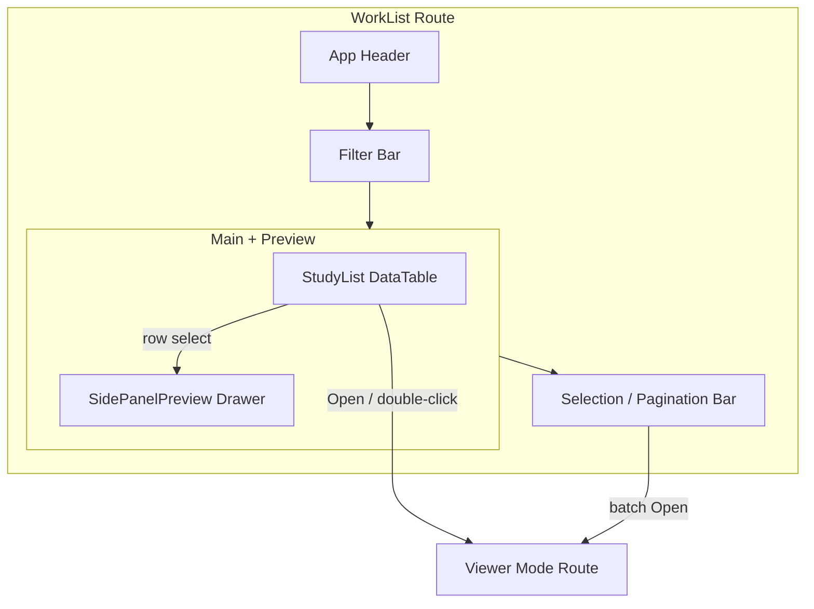
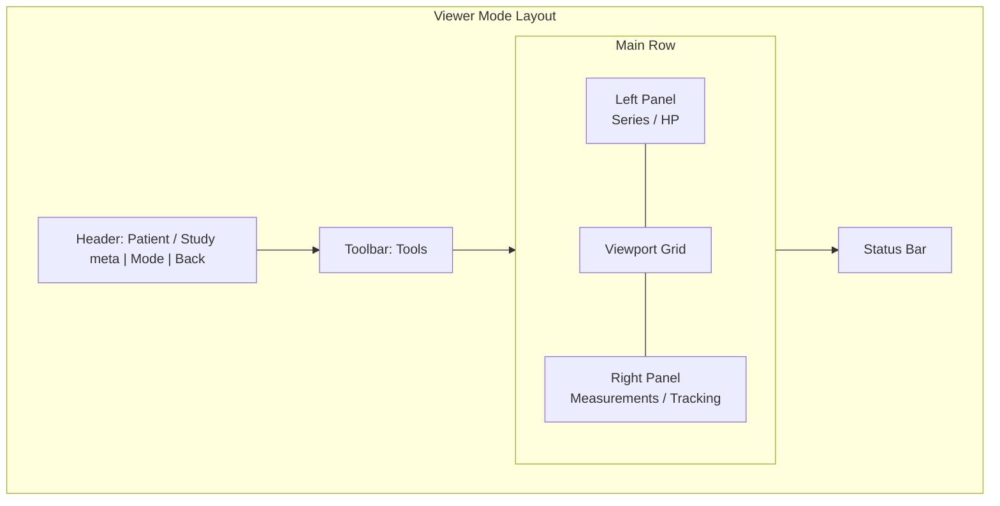
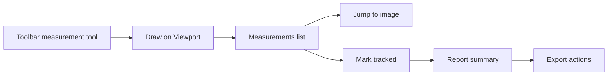

# OHIF Viewers 3.x 产品 Fork — UI 重设计规范

> **范围**：仅设计规范，不更换 UI 库。技术栈保持 React + `@ohif/ui-next`（shadcn / Radix / Tailwind）+ 少量遗留 `@ohif/ui`。  
> **路径锚点**：Study List → `platform/app/src/routes/WorkList/`（`StudyList` from `@ohif/ui-next`）；Viewer → mode routes（header / toolbar / panels / viewport grid）；测量追踪 → extension 驱动面板。  
> **实现约束**：无 MUI / Ant Design；后续映射至 Tailwind tokens + ui-next 组件。

---

## 1. 设计原则

| 原则 | 说明 |
|------|------|
| **临床密度（Clinical density）** | 阅读室场景下信息密度优先于留白美学；表格行高、工具条高度、面板内边距取紧凑档，减少滚动与视线跳转。 |
| **低认知负荷** | 同一时刻突出「当前任务」：WorkList 以检索/选检为主；Viewer 以影像阅读为主；测量/报告为辅助上下文，不抢 viewport。 |
| **Dark-first 阅读室** | 默认深色主题，降低环境光干扰；浅色仅作可选/打印导出，不以浅色为主路径。 |
| **清晰层级** | Canvas（最底层影像区）→ Elevated chrome → Sidebar/Panel → Overlay/Popover → Modal；颜色与阴影表达层级，避免同级区域互相「漂浮」。 |
| **无障碍对比度** | 正文与图标在深底上满足 WCAG AA（正文对比 ≥ 4.5:1，大字/图标 ≥ 3:1）；危险/警告色不仅靠色相，辅以图标与文案。 |
| **保持 OHIF 交互模型** | 不改变主流程：**WorkList → Viewer → Panels**；不引入全新导航范式；侧栏折叠、工具激活、viewport 布局切换逻辑与现有一致，仅优化视觉与信息架构（IA）。 |

**方向摘要**：现代临床深色、比库存 OHIF 偏紫默认略偏冷；**Accent = teal/cyan** 用于激活工具与焦点；阅读模式下避免糖果色饱和装饰。

---

## 2. 整站视觉规范（Design Tokens）

命名采用语义角色，便于后续映射到 Tailwind CSS variables / `@ohif/ui-next` theme。

### 2.1 Color roles

| Token | 值 | 用途 |
|-------|-----|------|
| `--bg-canvas` | `#0B0F14` | 主背景、viewport 外缘画布 |
| `--bg-elevated` | `#12181F` | Header、Toolbar、浮层卡片底 |
| `--bg-sidebar` | `#0E141B` | 左/右面板、WorkList 侧栏预览 |
| `--bg-row-hover` | `rgba(94, 234, 212, 0.06)` | 表格/列表行悬停 |
| `--bg-row-selected` | `rgba(45, 212, 191, 0.12)` | 多选/当前选中行 |
| `--bg-input` | `#161E27` | 输入框、Select 触发器 |
| `--border-subtle` | `#1E2A36` | 分区线、表格网格弱边 |
| `--border-strong` | `#2A3A4A` | 面板外框、焦点环外轮廓 |
| `--border-focus` | `#2DD4BF` | 键盘焦点环 |
| `--text-primary` | `#E8EEF4` | 标题、关键元数据、表格主列 |
| `--text-secondary` | `#9AA8B6` | 次要标签、列头、说明 |
| `--text-muted` | `#6B7A8A` | 占位符、禁用、时间戳弱信息 |
| `--text-inverse` | `#0B0F14` | 浅色按钮上的字 |
| `--accent` | `#2DD4BF` | 主行动、激活工具、链接、当前模式 |
| `--accent-muted` | `rgba(45, 212, 191, 0.18)` | 激活工具底、chip 背景 |
| `--accent-hover` | `#5EEAD4` | Hover 态 accent |
| `--success` | `#34D399` | 完成、已追踪、导出成功 |
| `--warn` | `#FBBF24` | 未完成测量、部分加载、注意 |
| `--danger` | `#F87171` | 删除、错误、关键失败 |
| `--info` | `#38BDF8` | 提示性信息（非主交互） |
| `--viewport-chrome` | `#0A0E12` | Viewport 边框/标签条底 |
| `--viewport-active` | `#2DD4BF` | 当前激活 viewport 描边（2px） |
| `--viewport-inactive` | `#1A2430` | 非激活 viewport 描边 |
| `--overlay-scrim` | `rgba(0, 0, 0, 0.55)` | Dialog / Drawer 遮罩 |
| `--scrollbar` | `#2A3A4A` | 滚动条滑块（轨道透明或 `--bg-sidebar`） |

**阅读模式约束**：viewport 内 overlay（十字线、标注、HU 读数）使用高对比浅色字 + 细描边阴影，不使用高饱和填充块；工具激活态用 `--accent` 描边/底，而非彩色图标堆叠。

### 2.2 Typography

| Token | 值 |
|-------|-----|
| `--font-sans` | `Inter, ui-sans-serif, system-ui, -apple-system, "Segoe UI", Roboto, "Noto Sans SC", "PingFang SC", "Microsoft YaHei", sans-serif` |
| `--font-mono` | `ui-monospace, "SF Mono", Menlo, Consolas, monospace`（UID、像素值、DICOM 标签） |

| 用途 | Size / Line / Weight | 备注 |
|------|----------------------|------|
| UI 标题（页面/面板） | 16px / 24px / 600 | WorkList 页头、面板标题 |
| UI 正文 | 13px / 20px / 400 | 表格单元格、表单 |
| UI 次要 | 12px / 16px / 400 | 列头、辅助说明 |
| UI 紧凑标签 | 11px / 14px / 500 | Toolbar 按钮字、Badge |
| Overlay（viewport 内） | 12–14px / 1.2 / 500 | 患者角标、窗宽窗位；带 `text-shadow` |
| Modal 标题 | 18px / 28px / 600 | Dialog |

中文优先保证「Noto Sans SC / PingFang / YaHei」回退；数字与 UID 可用 mono 提高扫读速度。

### 2.3 Spacing density（紧凑临床档）

| Token | 值 | 用途 |
|-------|-----|------|
| `--space-1` | 4px | 图标与字间距、紧凑 gap |
| `--space-2` | 8px | 控件内边距基准 |
| `--space-3` | 12px | 面板区块间距 |
| `--space-4` | 16px | 页面级边距 |
| `--space-5` | 24px | 大区块分隔（少用） |
| `--row-height-sm` | 32px | 紧凑表行、工具条按钮高 |
| `--row-height-md` | 36px | 默认表行 |
| `--header-height` | 40px | 顶栏 |
| `--toolbar-height` | 40px | 工具条 |
| `--statusbar-height` | 28px | 底栏 |
| `--panel-width-default` | 280px | 左/右面板默认宽 |
| `--panel-width-min` | 240px | 最小可拖 |
| `--panel-width-max` | 400px | 最大可拖 |
| `--preview-drawer-width` | 320px | WorkList SidePanelPreview |

### 2.4 Radius / Shadow / Z-index

| Token | 值 |
|-------|-----|
| `--radius-sm` | 4px（按钮、输入、badge） |
| `--radius-md` | 6px（卡片、下拉） |
| `--radius-lg` | 8px（Dialog、Drawer） |
| `--radius-full` | 9999px（pill chip） |
| `--shadow-elevated` | `0 1px 0 rgba(255,255,255,0.04), 0 8px 24px rgba(0,0,0,0.45)` |
| `--shadow-overlay` | `0 12px 40px rgba(0,0,0,0.55)` |
| `--z-base` | 0（viewport canvas） |
| `--z-chrome` | 10（header / toolbar / panels） |
| `--z-dropdown` | 40 |
| `--z-drawer` | 50 |
| `--z-modal` | 60 |
| `--z-toast` | 70 |
| `--z-tooltip` | 80 |

### 2.5 Icon style

- 与 **lucide** 兼容：24 网格、1.5–2px stroke、圆角端点；UI 内默认 **16px**，Toolbar **18–20px**。
- 激活态：图标色 = `--accent`，可选 `--accent-muted` 底；非激活 = `--text-secondary`。
- 避免多色填充图标；状态靠 badge / 小圆点（success/warn/danger）而非换整套彩色 icon。

---

## 3. Study List（WorkList）重设计

**路径**：`platform/app/src/routes/WorkList/`，组件 `StudyList`（`@ohif/ui-next`），已有可选 **SidePanelPreview** 右预览抽屉。

### 3.1 布局结构

```
┌─ App shell (bg-canvas) ─────────────────────────────────────────┐
│ Header: Logo | 环境/用户 | 设置入口                                │
├─ Filter bar (bg-elevated, sticky) ──────────────────────────────┤
│ [Patient] [MRN] [Accession] [Modality▾] [Date range] [Search]   │
│                                         [Clear] [Saved filters] │
├─ Content ──────────────────────────────┬─ Preview drawer (opt) ─┤
│ Dense DataTable                        │ SidePanelPreview       │
│ ☑ Patient | StudyDate | Modality | …   │ Thumbnail / meta       │
│ …                                      │ Series list            │
│                                        │ [Open Viewer]          │
├─ Footer / pagination / selection bar ──┴────────────────────────┤
│ Selected: N  [Open] [Compare] [Export CSV]     Page 1/…  50/页  │
└─ Empty / Loading / Error 覆盖同一 content 区域 ─────────────────┘
```

### 3.2 区域说明

| 区域 | 行为 |
|------|------|
| **Filter bar** | 单行优先；窄屏折行第二行。主搜索框支持 Patient Name / MRN / Accession 联合或切换；日期默认「最近 7 天」可配置。筛选变更防抖 300ms。 |
| **Dense table** | 行高 32–36px；斑马纹极弱或不使用（靠 hover/selected）；列可排序；水平滚动时固定首列 Patient + checkbox。 |
| **SidePanelPreview** | 选中单行时打开；多选时显示「已选 N 项」摘要 + 批量操作，不强制展开全部缩略图。 |
| **Empty** | 插画/图标 +「无匹配检查」+ 建议清除筛选；无营销文案。 |
| **Loading** | 表体骨架屏（skeleton rows），保留表头与 filter，避免整页闪白。 |
| **Error** | 行内横幅 + 重试；不阻断 filter 编辑。 |

### 3.3 列优先级

| 优先级 | 列 | 默认可见 | 备注 |
|--------|-----|----------|------|
| P0 | Checkbox | ✓ | 多选 |
| P0 | Patient Name | ✓ | 主列，可点开预览 |
| P0 | MRN / Patient ID | ✓ | mono 小字可叠第二行 |
| P0 | Study Date | ✓ | 本地时区格式化 |
| P0 | Modality | ✓ | 多模态 chip（CT, PT） |
| P1 | Description | ✓ | 截断 + tooltip |
| P1 | Accession | ✓ | |
| P1 | Instances / Series | 可选 | 数量 |
| P2 | Referring Physician | 列设置 | |
| P2 | Study UID | 列设置 | mono，默认隐藏 |

### 3.4 搜索与多选 UX

- **搜索**：回车立即查；清空显示「×」；最近搜索下拉（本地，可选）。
- **多选**：Shift 连续选、Ctrl/Cmd 点选；底栏 sticky selection bar 显示 N 与主操作。
- **主操作**：Open（单选进 Viewer）、Open in new tab（可选）、Compare（2+ 限制按产品规则）、导出列表。
- **行双击**：等同 Open（保持 OHIF 习惯）。

### 3.5 Wireframe（Mermaid）



```
ASCII — 默认桌面（≥1280px）

+------------------------------------------------------------------+
| OHIF Fork          user@site                    [Settings]       |
+------------------------------------------------------------------+
| Filters: [==== Search ====] [Modality v] [Date] [Clear]          |
+------------------------------------------------+-----------------+
| ☐ Patient      Date     Mod  Description       | Preview         |
| ☑ Zhang*       2026-09  CT   Chest ...         | [thumb]         |
| ☐ Li           2026-09  MR   Brain             | Series 1/4      |
| ...                                            | [Open Viewer]   |
+------------------------------------------------+-----------------+
| Selected: 1   [Open]                    < 1 2 3 >   50 / page    |
+------------------------------------------------------------------+
```

---

## 4. Viewer 主界面

**结构**：mode routes — Header + Toolbar + Left/Right Panels + Viewport Grid + Status Bar。

### 4.1 区域职责

| 区域 | 高度/宽度 | 内容 |
|------|-----------|------|
| **Top Header** | 40px | 患者姓名、性别/年龄、Study 日期/描述、Modality；右侧 Mode 切换、布局、设置、返回 WorkList |
| **Toolbar** | 40px | 工具组（窗宽窗位、缩放、测量、标注、同步、播放等）；激活态用 accent |
| **Left Panel** | 可折叠 280px | 系列缩略图、挂载协议 / hanging protocol、显示设置（按 mode） |
| **Right Panel** | 可折叠 280px | 测量列表、追踪/报告、分割等 extension 面板（Tab） |
| **Viewport Grid** | flex 1 | 1×1 / 1×2 / 2×2…；激活 viewport 用 `--viewport-active` 描边 |
| **Status Bar** | 28px | 加载进度、DICOM 连接状态、当前工具、快捷键提示弱文案 |

### 4.2 面板折叠与阅读减负（Reduce chrome）

- **折叠**：面板标题栏左侧 chevron；折叠后留 **36px** 图标轨（rail），一键展开。
- **双面板同时开**：viewport 优先保证最小宽度；窄屏（&lt;1280）默认只开一侧。
- **阅读减负模式（可选快捷键）**：隐藏 Header 次要按钮、压缩 Toolbar 为 icon-only、双面板收至 rail；viewport 最大化。退出即恢复。
- **不改变** OHIF 的工具点击、viewport 点击激活、右键菜单心智模型。

### 4.3 Mermaid 布局



```
ASCII — 阅读态（双面板展开）

+------------------------------------------------------------------+
| ◀ WorkList | Zhang San  M/45 | CT Chest 2026-09-10 | Mode v | ⚙ |
+------------------------------------------------------------------+
| [W/L] [Zoom] [Pan] [Length] [Probe] [Bidirectional] …    [Layout]|
+------+-----------------------------------------------+-----------+
| Ser. |                                               | Measure   |
| [ ]  |              VIEWPORT GRID                    | Tracking  |
| [ ]  |           (active border teal)                | Report    |
| HP   |                                               |           |
+------+-----------------------------------------------+-----------+
| Ready | Tool: Length | Series 2/4 Img 34/120                       |
+------------------------------------------------------------------+
```

---

## 5. 测量 / 报告面板

保持 **measurement-tracking** extension 心智模型：测量 → 追踪状态 → 报告/导出；只清理 IA 与视觉。

### 5.1 Measurement list

| 要素 | 规范 |
|------|------|
| **分组** | 默认按 Study → Series；组头可折叠，显示数量。 |
| **行内容** | 类型图标 + 标签/自动名 + 数值摘要（如长度 mm）+ 状态点 |
| **状态** | `active`（当前）/ `tracked`（已纳入追踪）/ `untracked` / `warning`（无效或缺失图） |
| **交互** | 单击高亮并 **jump-to-image**（切 series + image index）；双击聚焦对应 viewport；行悬停显示「定位 / 重命名 / 删除」 |
| **空态** | 「暂无测量 — 在工具栏选择 Length / Bidirectional 等」 |

### 5.2 Report / Tracking 面板结构

```
Right Panel Tabs:  [Measurements] [Tracking] [Report]
                    （具体 Tab 名随 extension 配置，IA 顺序建议如此）

Tracking:
  - 当前 Study 追踪摘要（已追踪 N / 共 M）
  - 列表与 Measurement 同源数据，强调 status 与「是否在报告中」
  - 操作：Mark tracked / Untrack（与现有模型一致）

Report:
  - 只读或半只读摘要区（患者 + 关键关键测量）
  - 导出动作区固定在面板底部 sticky：
      [Copy] [Download JSON/CSV] [SR Export*] [*若产品启用]
  - 不把导出藏进深层菜单；危险操作（清空）需确认 Dialog
```

### 5.3 导出动作放置

- **面板底 sticky footer**：主导出；使用 `Button` variant primary（accent）仅一个主按钮，其余 ghost/outline。
- **Header 溢出菜单**：次要分享/打印，避免与阅读工具抢 toolbar 空间。

### 5.4 IA 示意（Mermaid）



---

## 6. 组件映射（不换库）

设计元素 → 优先 `@ohif/ui-next` 原语（实现延后）。遗留 `@ohif/ui` 仅作过渡包裹，新皮优先 ui-next。

| 设计元素 | 建议 ui-next / 模式 | 备注 |
|----------|---------------------|------|
| 主按钮 / 工具按钮 | `Button` | Toolbar 用 size sm；icon + 可选 label |
| 危险确认 | `Dialog` + `Button` | 删除测量、清空追踪 |
| 筛选输入 | `Input` / `Select` / `Popover` + calendar | Filter bar |
| Study 表格 | `DataTable`（或 Table 原语组合） | 排序、选择、虚拟滚动若已有则保留 |
| 页头 | `Header` / 自定义 layout + tokens | WorkList 与 Viewer 共用高度 token |
| 侧栏 / 预览 | `SidePanel` / Drawer 模式（含已有 SidePanelPreview） | 右预览 320px |
| 面板 Tab | `Tabs` | Measurements / Tracking / Report |
| 工具条分隔 | `Separator` + Toolbar 组合 | |
| 状态点 / 计数 | `Badge` | modality chip、测量状态 |
| 提示 | `Tooltip` | 截断文本、工具说明 |
| 下拉菜单 | `DropdownMenu` | 列设置、导出次要项 |
| 开关 | `Switch` / `Checkbox` | 显示选项、多选 |
| Toast | 现有通知机制 + token 色 | 导出成功/失败 |
| 图标 | lucide-react（与 ui-next 一致） | 16–20px |

**Tailwind 映射原则（落地时）**：颜色走 CSS variables（上表 token）；间距用 `p-2`/`gap-1` 等贴近 `--space-*`；避免任意魔法色 hex 散落组件。

---

## 7. 分阶段落地建议

| 阶段 | 目标 | 交付物 | 验收要点 |
|------|------|--------|----------|
| **Phase 0 — Tokens** | 建立暗色语义 token 与字体/间距 | 全局 CSS variables / Tailwind theme 扩展；文档本节 2.x 落地 | 对比度抽检；无业务逻辑改动 |
| **Phase 1 — Study List skin** | WorkList 视觉与密度 | `WorkList/` + `StudyList` 皮肤：filter、表、empty/loading、SidePanelPreview、selection bar | 不改路由与数据源；多选/Open 行为回归 |
| **Phase 2 — Viewer chrome** | Header / Toolbar / Panels / Status / viewport 描边 | mode 壳层减负与折叠 rail；accent 激活态 | 工具与布局快捷键仍可用；面板拖拽宽度范围符合 token |
| **Phase 3 — Measurement panels** | 测量列表 IA 与报告底栏 | 分组、状态、jump-to-image、sticky 导出 | tracking 状态机不变；导出入口可见且可测 |

**依赖顺序**：0 → 1 与 2 可部分并行（1 不依赖 Viewer），3 依赖 0 与 2 的面板壳。  
**明确不做**：更换组件库、重写 extension 协议、改变 WorkList→Viewer→Panels 主路径。

---

## 附录 A — 对比度速查（设计自检）

| 前景 | 背景 | 预期 |
|------|------|------|
| `#E8EEF4` on `#0B0F14` | 正文 | 通过 AA |
| `#9AA8B6` on `#0B0F14` | 次要 | 宜 ≥ AA Large / 慎用于小字 |
| `#2DD4BF` on `#0B0F14` | 链接/激活 | 图标与大字可用；小字链接可加 underline |
| `#F87171` on `#0B0F14` | 危险 | 搭配图标 + 文案 |

## 附录 B — 相关路径速查

| 区域 | 路径 / 包 |
|------|-----------|
| WorkList | `platform/app/src/routes/WorkList/` |
| StudyList | `@ohif/ui-next` → `StudyList` |
| Preview | SidePanelPreview（现有） |
| Viewer | mode routes（header / toolbar / panels / viewport grid） |
| UI 包 | `@ohif/ui-next`（主）、`@ohif/ui`（遗留轻量） |
| 测量 | measurement-tracking 等 extension 面板 |

---

*文档版本：1.0 · 设计专用 · 实现映射见第 6–7 节*
